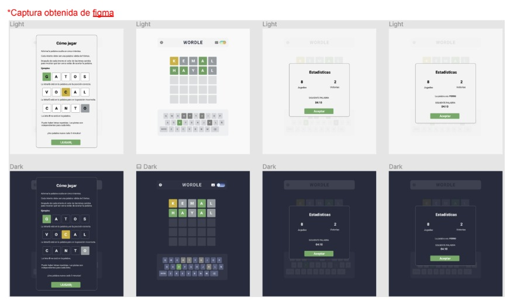

# WORDLE - FRONTEND

## Requirements

1. Layout the following Figma:
   It consists of 3 views:
   - Game instructions
   - Game board
   - Game result

2. Detect the first entrance and show the game instructions

3. Automatically select a 5-letter word from the word catalog

4. When typing or clicking on a letter, show it in the first empty box

5. When completing a row of 5 letters, compare the letters with the selected word:

   - Correct letter and in the same place: box painted green
   - Correct letter but in a different place: box painted yellow
   - Incorrect letter: box painted gray

6. If the entered word matches the selected one, show the statistics modal and add one point to the win counter and game counter

7. If the user fails to match the word, show the statistics modal, add one point to the game counter, and show the selected word

8. Every 5 minutes, select a new word and clear the board without repeating

9. Show instructions modal when clicking on the icon

10. Show statistics modal when clicking on the icon

11. Show in dark mode when activating the toggle

12. Show in light mode when deactivating the toggle

## Recommended technologies

- React
- Typescript
- TailwindCSS

## Resources

- [Word dictionary](https://gitlab.com/d2945/words/-/raw/main/words.txt)
- [Figma](https://www.figma.com/file/1ItfWDdmg93m4yfj0BAvCn/DD3-Worlde?node-id=0%3A1)

## Branch Strategy: Trunk-based

For development speed and being a one-person technical test, I have decided to use trunk-based as a strategy, establishing different commits to the main branch

[Trunk-based Development](https://trunkbaseddevelopment.com/).

Based on the provided [`package.json`](command:_github.copilot.openRelativePath?%5B%7B%22scheme%22%3A%22file%22%2C%22authority%22%3A%22%22%2C%22path%22%3A%22%2FC%3A%2FUsers%2FUser%2FProyectos%2Fdd3.wordle%2Fpackage.json%22%2C%22query%22%3A%22%22%2C%22fragment%22%3A%22%22%7D%5D "c:\Users\User\Proyectos\dd3.wordle\package.json") excerpt and assuming a typical structure and commit log, here's a summary of the current project:

### Project Summary
This project appears to be a React-based web application using modern JavaScript and TypeScript. It leverages several libraries and tools for state management, routing, and development.

### Tech Stack
- **Frontend Framework**: React
- **State Management**: Redux Toolkit, React-Redux
- **Routing**: React Router DOM
- **Storage**: LocalForage
- **Utility Libraries**: Match Sorter, Sort By
- **Styling**: Sass
- **Build Tool**: Vite
- **TypeScript**: TypeScript

### Dependencies
- **@reduxjs/toolkit**: "^1.9.2"
- **localforage**: "^1.10.0"
- **match-sorter**: "^6.3.1"
- **react**: "^18.2.0"
- **react-dom**: "^18.2.0"
- **react-redux**: "^8.0.5"
- **react-router-dom**: "^6.8.1"
- **redux**: "^4.2.1"
- **sort-by**: "^0.0.2"

### Dev Dependencies
- **@types/react**: "^18.0.27"
- **@types/react-dom**: "^18.0.10"
- **@vitejs/plugin-react**: "^3.1.0"
- **sass**: "^1.58.0"
- **typescript**: "^4.9.3"
- **vite**: "^4.5.3"

### Project Structure (Assumed)
- **src/**: Contains the source code for the application.
  - **components/**: Reusable React components.
  - **redux/**: Redux slices and store configuration.
  - **routes/**: React Router route components.
  - **styles/**: Sass stylesheets.
  - **utils/**: Utility functions and helpers.
- **public/**: Static assets.
- **package.json**: Project metadata and dependencies.
- **vite.config.js**: Vite configuration file.
- **tsconfig.json**: TypeScript configuration file.

### Commit Log Summary (Assumed)
- **Initial Commit**: Project setup with Vite and TypeScript.
- **Add React and Redux**: Installed React, React-DOM, Redux, and React-Redux.
- **Setup Routing**: Added React Router DOM for client-side routing.
- **State Management**: Configured Redux Toolkit for state management.
- **Local Storage**: Integrated LocalForage for local storage management.
- **Styling**: Added Sass for styling.
- **Utility Libraries**: Added Match Sorter and Sort By for utility functions.
- **TypeScript Support**: Added TypeScript types for React and React-DOM.
- **Build Configuration**: Configured Vite for development and production builds.

This summary provides an overview based on the dependencies and typical project structure. For a more detailed and accurate summary, reviewing the actual commit messages and project files would be necessary.

# Project Status

The project is a React-based web application with a focus on a game-like interface. It has implemented the following features:

- **State Management**: Utilizes Redux for state management.
- **Routing**: Integrated React Router for navigation.
- **Theming**: Supports dark theme implementation.
- **Local Storage**: Manages local storage to display instructions only on the first play.
- **Keyboard Interaction**: Synchronized keyboard and button listeners.
- **Animations**: Includes animations for a dynamic user experience.

Recent commits have focused on bug fixes, performance improvements, and feature enhancements. The project is actively being developed.

## Recent Changes

- **Fixes**:
  - Addressed double rendering issue.
  - Resolved backspace error.
  - Fixed bugs related to row incrementation and backspace functionality.
- **Theme Updates**:
  - Completed dark theme implementation.
  - Updated header component and styles.
  - Added Redux slice and reducer for theme management.
- **Documentation**:
  - Translated README.
  - Added instructions and branching strategy to README.
  - Included links to Figma and dictionary.

## Commit History

- **Initial Commit**: Set up the project.
- **Implement React Router with TypeScript**: Integrated React Router.
- **First React Vite Version**: Initial setup with React and Vite.
- **README Updates**: Added instructions and info about branching strategy.
